# Current Architecture Diagram

This diagram reflects the system as it exists today:

- ingestion is implemented
- queued corpus expansion with `RQ + Redis` is implemented
- Postgres + pgvector storage is implemented
- lexical, semantic, and fused retrieval APIs are implemented
- grounded answer generation is implemented
- a minimal FastAPI-served UI is implemented

```mermaid
flowchart LR
    source["ClinicalTrials.gov API<br/>study records"]

    subgraph jobs["Queued Ingestion"]
        job_api["FastAPI ingestion job API<br/>/api/v1/ingestion/jobs"]
        redis["Redis + RQ queue"]
        worker["RQ worker<br/>apps/api/app/worker.py"]
    end

    subgraph preprocessing["Preprocessing / Corpus Construction"]
        fetch["Fetch raw studies<br/>scripts/fetch_trials_raw.py"]
        normalize["Parse + normalize<br/>scripts/normalize_trial.py"]
        validate["Validate scope + quality<br/>scripts/validate_trial.py"]
        taxonomy["Condition taxonomy<br/>scripts/lib/condition_taxonomy.py"]
        chunk["Field-aware chunking<br/>scripts/generate_chunks.py"]
        embed["Chunk embeddings<br/>OpenAI or local debug"]
    end

    subgraph storage["Storage"]
        files["File artifacts<br/>data/raw, data/processed_runs"]
        db["Postgres + pgvector<br/>trials, validation, chunks, embeddings"]
    end

    subgraph retrieval["Backend Retrieval"]
        api["FastAPI<br/>apps/api/app/main.py"]
        filters["Structured filters<br/>condition, phase, study_type,<br/>accepted_only, year_2026_only"]
        lexical["Lexical retrieval<br/>Postgres full-text search"]
        semantic["Semantic retrieval<br/>pgvector similarity"]
        fused["Fused ranking<br/>weighted lexical + semantic"]
        ask["Grounded answer generation<br/>/api/v1/ask"]
    end

    subgraph runtime["Query Pipeline"]
        chat["Chat question<br/>homepage or trial detail"]
        infer["Infer / apply scope from question<br/>plus any explicit filters"]
        retrieve["Run fused retrieval<br/>top chunk evidence"]
        answer["Generate grounded answer<br/>OpenAI responses API"]
        render["Render answer + matched trials<br/>+ evidence snippets + citations"]
    end

    subgraph client["Client / Consumer"]
        user["User / frontend client"]
        ui["FastAPI-served chat-first UI<br/>finder, detail, ask, citations"]
        endpoints["API endpoints<br/>search, semantic, fused, ask,<br/>trial detail, ingestion jobs"]
    end

    job_api --> redis
    redis --> worker

    source --> fetch
    worker --> fetch
    fetch --> files
    fetch --> normalize
    normalize --> validate
    taxonomy --> normalize
    validate --> chunk
    chunk --> embed
    normalize --> db
    validate --> db
    chunk --> db
    embed --> db

    user --> ui
    user --> endpoints
    ui --> api
    endpoints --> api
    ui --> chat
    chat --> infer
    infer --> api
    api --> filters
    filters --> db
    db --> lexical
    db --> semantic
    lexical --> fused
    semantic --> fused
    fused --> retrieve
    retrieve --> answer
    fused --> ask
    ask --> answer
    answer --> render
    retrieve --> render
    render --> ui
    ask --> endpoints
    fused --> endpoints
```

## How to read it

1. Source records are fetched from ClinicalTrials.gov either manually or through queued ingestion jobs.
2. The worker runs fetch, normalize, validate, chunk, embed, and load steps.
3. The processed corpus is stored in Postgres + pgvector.
4. The query pipeline starts from a chat question in the UI, then infers or applies scope before hitting the API.
5. The FastAPI backend applies structured filters first, then lexical and semantic retrieval.
6. The fused layer combines those signals into one ranked result set and returns top chunk evidence.
7. The ask layer synthesizes grounded answers from retrieved evidence.
8. The UI renders the answer together with matched trials, evidence snippets, and citations.

## Key design point

This is a hybrid retrieval system, not a chatbot-first architecture.

The retrieval stack is the core:

- structured filtering narrows the search space
- lexical retrieval handles exact term matching
- semantic retrieval handles conceptual matching
- fused ranking combines both transparently

Queued ingestion sits beside that retrieval core so the corpus can grow without manual pipeline execution.

The product surface is now chat-first, but the runtime behavior is still retrieval-first underneath:

- the question drives scope and retrieval
- retrieval produces ranked chunk evidence
- the answer is generated from that evidence
- the UI shows the answer and the supporting studies together
