# Current Architecture Diagram

This diagram reflects the system as it exists today:

- ingestion is implemented
- Postgres + pgvector storage is implemented
- lexical, semantic, and fused retrieval APIs are implemented
- grounded answer generation is the next layer, not yet built

```mermaid
flowchart LR
    source["ClinicalTrials.gov API<br/>study records"]

    subgraph preprocessing["Preprocessing / Corpus Construction"]
        fetch["Fetch raw studies<br/>scripts/fetch_trials_raw.py"]
        normalize["Parse + normalize<br/>scripts/normalize_trial.py"]
        validate["Validate scope + quality<br/>scripts/validate_trial.py"]
        taxonomy["Condition taxonomy<br/>scripts/lib/condition_taxonomy.py"]
        chunk["Field-aware chunking<br/>scripts/generate_chunks.py"]
        embed["Chunk embeddings<br/>OpenAI or local debug"]
    end

    subgraph storage["Storage"]
        files["File artifacts<br/>data/raw, data/processed_runs"]
        db["Postgres + pgvector<br/>trials, validation, chunks, embeddings"]
    end

    subgraph retrieval["Backend Retrieval"]
        api["FastAPI<br/>apps/api/app/main.py"]
        filters["Structured filters<br/>condition, phase, study_type,<br/>accepted_only, year_2026_only"]
        lexical["Lexical retrieval<br/>Postgres full-text search"]
        semantic["Semantic retrieval<br/>pgvector similarity"]
        fused["Fused ranking<br/>weighted lexical + semantic"]
    end

    subgraph client["Client / Consumer"]
        user["User / frontend client"]
        endpoints["API endpoints<br/>/api/v1/search<br/>/api/v1/search/semantic<br/>/api/v1/search/fused"]
    end

    subgraph nextlayer["Next Layer"]
        answer["Grounded answer generation<br/>retrieve chunks -> synthesize -> cite fields"]
    end

    source --> fetch
    fetch --> files
    fetch --> normalize
    normalize --> validate
    taxonomy --> normalize
    validate --> chunk
    chunk --> embed
    normalize --> db
    validate --> db
    chunk --> db
    embed --> db

    user --> endpoints
    endpoints --> api
    api --> filters
    filters --> db
    db --> lexical
    db --> semantic
    lexical --> fused
    semantic --> fused
    fused --> endpoints
    endpoints --> answer
```

## How to read it

1. Source records are fetched from ClinicalTrials.gov.
2. They are normalized, validated, taxonomy-labeled, chunked, and embedded.
3. The processed corpus is stored in Postgres + pgvector.
4. The FastAPI backend applies structured filters first, then lexical and semantic retrieval.
5. The fused layer combines those signals into one ranked result set.
6. The next unbuilt layer is answer generation over retrieved chunks.

## Key design point

This is a hybrid retrieval system, not a chatbot-first architecture.

The retrieval stack is the core:

- structured filtering narrows the search space
- lexical retrieval handles exact term matching
- semantic retrieval handles conceptual matching
- fused ranking combines both transparently
