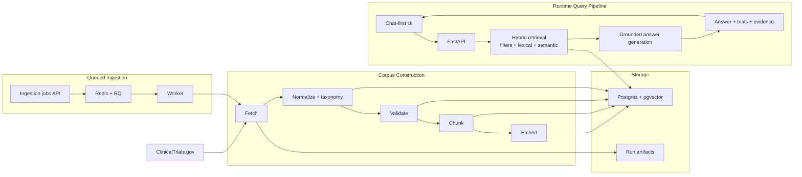

# Current Architecture Diagram

This simplified diagram reflects the system as it exists today.

## How to read it

1. ClinicalTrials.gov records are fetched either manually or through queued ingestion jobs.
2. The ingestion pipeline fetches, normalizes, validates, chunks, and embeds the corpus.
3. The processed corpus is stored in Postgres + pgvector, with run artifacts also kept on disk.
4. At query time, the chat UI sends a question to FastAPI.
5. The backend runs hybrid retrieval over the stored corpus.
6. The answer layer generates a grounded response from retrieved evidence.
7. The UI renders the answer together with matched trials and evidence.

## Key design point

The product surface is chat-first, but the system underneath is still retrieval-first:

- ingestion builds the corpus
- retrieval finds the right trial evidence
- answer generation stays grounded in that evidence
